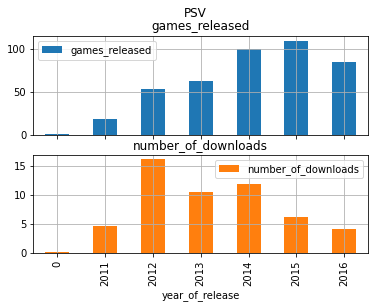

# Analysis of video games sales metrics for online video game store "Streamchik"

Video games store “Streamchik” sells games worldwide. We have historical data on sales, user rating and expert rating of games, as well as their genres and platforms those games were available for (e.g. Xbox, PlayStation etc.) Our task is to describe factors that effect popularity and sales of games in order to help “Streamchik” distribute marketing budget efficiently

## Introduction to the dataset


```python
import pandas as pd
import numpy as np
from scipy import stats as st
import matplotlib.pyplot as plt 
import seaborn as sns
```


```python
df = pd.read_csv('Module_1/games.csv') #lets download the set
```


```python
df.info()
```

    <class 'pandas.core.frame.DataFrame'>
    RangeIndex: 16715 entries, 0 to 16714
    Data columns (total 11 columns):
     #   Column           Non-Null Count  Dtype  
    ---  ------           --------------  -----  
     0   Name             16713 non-null  object 
     1   Platform         16715 non-null  object 
     2   Year_of_Release  16446 non-null  float64
     3   Genre            16713 non-null  object 
     4   NA_sales         16715 non-null  float64
     5   EU_sales         16715 non-null  float64
     6   JP_sales         16715 non-null  float64
     7   Other_sales      16715 non-null  float64
     8   Critic_Score     8137 non-null   float64
     9   User_Score       10014 non-null  object 
     10  Rating           9949 non-null   object 
    dtypes: float64(6), object(5)
    memory usage: 1.4+ MB
    

We have 16,7 thousand lines in our dataframe. Data on platformas and sales are compleat. We miss 249 dates of releasa. Data on critic and user score and age rating is missing for 40-50% of the set.

##  Data preprocessing


```python
df.columns=df.columns.str.lower() #I change all column titles to lower case to avoide any trouble
```

I will change critic score tipe to int as it is in fact an integer between 1 and 100 according to data description


```python
df['critic_score'] = df['critic_score'].fillna(0)# To avoide any trouble I fill nones wth 0
df['critic_score'] = df['critic_score'].astype('int')
```

This column misses 51% of data. I see no point to fill missing data with any artificially generated figure as critic score is an independent metric, by its nature it doesn’t depend on any other data that we have available, like genre, console. Therefore I will leave this gap unfilled and work with as much data as we have.


```python
df['user_score'].unique() #Let's have a look at the user score
```


    array(['8', nan, '8.3', '8.5', '6.6', '8.4', '8.6', '7.7', '6.3', '7.4',
           '8.2', '9', '7.9', '8.1', '8.7', '7.1', '3.4', '5.3', '4.8', '3.2',
           '8.9', '6.4', '7.8', '7.5', '2.6', '7.2', '9.2', '7', '7.3', '4.3',
           '7.6', '5.7', '5', '9.1', '6.5', 'tbd', '8.8', '6.9', '9.4', '6.8',
           '6.1', '6.7', '5.4', '4', '4.9', '4.5', '9.3', '6.2', '4.2', '6',
           '3.7', '4.1', '5.8', '5.6', '5.5', '4.4', '4.6', '5.9', '3.9',
           '3.1', '2.9', '5.2', '3.3', '4.7', '5.1', '3.5', '2.5', '1.9', '3',
           '2.7', '2.2', '2', '9.5', '2.1', '3.6', '2.8', '1.8', '3.8', '0',
           '1.6', '9.6', '2.4', '1.7', '1.1', '0.3', '1.5', '0.7', '1.2',
           '2.3', '0.5', '1.3', '0.2', '0.6', '1.4', '0.9', '1', '9.7'],
          dtype=object)


```python
df.query('user_score=="tbd"') #Among other scores and nans we have some lines with 'tbd' in it
```


<div>
<style scoped>
    .dataframe tbody tr th:only-of-type {
        vertical-align: middle;
    }

    .dataframe tbody tr th {
        vertical-align: top;
    }

    .dataframe thead th {
        text-align: right;
    }
</style>
<table border="1" class="dataframe">
  <thead>
    <tr style="text-align: right;">
      <th></th>
      <th>name</th>
      <th>platform</th>
      <th>year_of_release</th>
      <th>genre</th>
      <th>na_sales</th>
      <th>eu_sales</th>
      <th>jp_sales</th>
      <th>other_sales</th>
      <th>critic_score</th>
      <th>user_score</th>
      <th>rating</th>
    </tr>
  </thead>
  <tbody>
    <tr>
      <th>119</th>
      <td>Zumba Fitness</td>
      <td>Wii</td>
      <td>2010.0</td>
      <td>Sports</td>
      <td>3.45</td>
      <td>2.59</td>
      <td>0.0</td>
      <td>0.66</td>
      <td>0</td>
      <td>tbd</td>
      <td>E</td>
    </tr>
    <tr>
      <th>301</th>
      <td>Namco Museum: 50th Anniversary</td>
      <td>PS2</td>
      <td>2005.0</td>
      <td>Misc</td>
      <td>2.08</td>
      <td>1.35</td>
      <td>0.0</td>
      <td>0.54</td>
      <td>61</td>
      <td>tbd</td>
      <td>E10+</td>
    </tr>
    <tr>
      <th>520</th>
      <td>Zumba Fitness 2</td>
      <td>Wii</td>
      <td>2011.0</td>
      <td>Sports</td>
      <td>1.51</td>
      <td>1.03</td>
      <td>0.0</td>
      <td>0.27</td>
      <td>0</td>
      <td>tbd</td>
      <td>T</td>
    </tr>
    <tr>
      <th>645</th>
      <td>uDraw Studio</td>
      <td>Wii</td>
      <td>2010.0</td>
      <td>Misc</td>
      <td>1.65</td>
      <td>0.57</td>
      <td>0.0</td>
      <td>0.20</td>
      <td>71</td>
      <td>tbd</td>
      <td>E</td>
    </tr>
    <tr>
      <th>657</th>
      <td>Frogger's Adventures: Temple of the Frog</td>
      <td>GBA</td>
      <td>NaN</td>
      <td>Adventure</td>
      <td>2.15</td>
      <td>0.18</td>
      <td>0.0</td>
      <td>0.07</td>
      <td>73</td>
      <td>tbd</td>
      <td>E</td>
    </tr>
    <tr>
      <th>...</th>
      <td>...</td>
      <td>...</td>
      <td>...</td>
      <td>...</td>
      <td>...</td>
      <td>...</td>
      <td>...</td>
      <td>...</td>
      <td>...</td>
      <td>...</td>
      <td>...</td>
    </tr>
    <tr>
      <th>16695</th>
      <td>Planet Monsters</td>
      <td>GBA</td>
      <td>2001.0</td>
      <td>Action</td>
      <td>0.01</td>
      <td>0.00</td>
      <td>0.0</td>
      <td>0.00</td>
      <td>67</td>
      <td>tbd</td>
      <td>E</td>
    </tr>
    <tr>
      <th>16697</th>
      <td>Bust-A-Move 3000</td>
      <td>GC</td>
      <td>2003.0</td>
      <td>Puzzle</td>
      <td>0.01</td>
      <td>0.00</td>
      <td>0.0</td>
      <td>0.00</td>
      <td>53</td>
      <td>tbd</td>
      <td>E</td>
    </tr>
    <tr>
      <th>16698</th>
      <td>Mega Brain Boost</td>
      <td>DS</td>
      <td>2008.0</td>
      <td>Puzzle</td>
      <td>0.01</td>
      <td>0.00</td>
      <td>0.0</td>
      <td>0.00</td>
      <td>48</td>
      <td>tbd</td>
      <td>E</td>
    </tr>
    <tr>
      <th>16704</th>
      <td>Plushees</td>
      <td>DS</td>
      <td>2008.0</td>
      <td>Simulation</td>
      <td>0.01</td>
      <td>0.00</td>
      <td>0.0</td>
      <td>0.00</td>
      <td>0</td>
      <td>tbd</td>
      <td>E</td>
    </tr>
    <tr>
      <th>16706</th>
      <td>Men in Black II: Alien Escape</td>
      <td>GC</td>
      <td>2003.0</td>
      <td>Shooter</td>
      <td>0.01</td>
      <td>0.00</td>
      <td>0.0</td>
      <td>0.00</td>
      <td>0</td>
      <td>tbd</td>
      <td>T</td>
    </tr>
  </tbody>
</table>
<p>2424 rows × 11 columns</p>
</div>


We see 'tbd' in over 10% of data. There are games of different genres, years of release and platforms. It might be an error or it could mean something like "to be defined". In any case I see no difference in this artifact and nan for the purposes of this study.


```python
df['user_score'] = pd.to_numeric(df['user_score'], errors='coerce')#I'll change type to float, and fil nans and tbds with 0
```


```python
df['user_score'].corr(df['critic_score'])
```


    0.4219902741457303


I noticed that in certain lies one of the scores is missing, while another is not. However, correlation between these two indicators is fairly low, which makes sense. Often games and movies are underestimated by critics but quite popular among general public and vise a versa. Therefore, I will not try to generate one of these metrics out of another.
And just as for critic score, I see no point trying to replace missing data with any artificially generated figure. I will just work with as much data as I have on hand.


```python
df['year_of_release'] = df['year_of_release'].fillna(0) #I will keep year of release as an integer as I only have a year 
df['year_of_release'] = df['year_of_release'].astype('int') #so I do not need to work with it as date
display(df)
```


<div>
<style scoped>
    .dataframe tbody tr th:only-of-type {
        vertical-align: middle;
    }

    .dataframe tbody tr th {
        vertical-align: top;
    }

    .dataframe thead th {
        text-align: right;
    }
</style>
<table border="1" class="dataframe">
  <thead>
    <tr style="text-align: right;">
      <th></th>
      <th>name</th>
      <th>platform</th>
      <th>year_of_release</th>
      <th>genre</th>
      <th>na_sales</th>
      <th>eu_sales</th>
      <th>jp_sales</th>
      <th>other_sales</th>
      <th>critic_score</th>
      <th>user_score</th>
      <th>rating</th>
    </tr>
  </thead>
  <tbody>
    <tr>
      <th>0</th>
      <td>Wii Sports</td>
      <td>Wii</td>
      <td>2006</td>
      <td>Sports</td>
      <td>41.36</td>
      <td>28.96</td>
      <td>3.77</td>
      <td>8.45</td>
      <td>76</td>
      <td>8.0</td>
      <td>E</td>
    </tr>
    <tr>
      <th>1</th>
      <td>Super Mario Bros.</td>
      <td>NES</td>
      <td>1985</td>
      <td>Platform</td>
      <td>29.08</td>
      <td>3.58</td>
      <td>6.81</td>
      <td>0.77</td>
      <td>0</td>
      <td>NaN</td>
      <td>NaN</td>
    </tr>
    <tr>
      <th>2</th>
      <td>Mario Kart Wii</td>
      <td>Wii</td>
      <td>2008</td>
      <td>Racing</td>
      <td>15.68</td>
      <td>12.76</td>
      <td>3.79</td>
      <td>3.29</td>
      <td>82</td>
      <td>8.3</td>
      <td>E</td>
    </tr>
    <tr>
      <th>3</th>
      <td>Wii Sports Resort</td>
      <td>Wii</td>
      <td>2009</td>
      <td>Sports</td>
      <td>15.61</td>
      <td>10.93</td>
      <td>3.28</td>
      <td>2.95</td>
      <td>80</td>
      <td>8.0</td>
      <td>E</td>
    </tr>
    <tr>
      <th>4</th>
      <td>Pokemon Red/Pokemon Blue</td>
      <td>GB</td>
      <td>1996</td>
      <td>Role-Playing</td>
      <td>11.27</td>
      <td>8.89</td>
      <td>10.22</td>
      <td>1.00</td>
      <td>0</td>
      <td>NaN</td>
      <td>NaN</td>
    </tr>
    <tr>
      <th>...</th>
      <td>...</td>
      <td>...</td>
      <td>...</td>
      <td>...</td>
      <td>...</td>
      <td>...</td>
      <td>...</td>
      <td>...</td>
      <td>...</td>
      <td>...</td>
      <td>...</td>
    </tr>
    <tr>
      <th>16710</th>
      <td>Samurai Warriors: Sanada Maru</td>
      <td>PS3</td>
      <td>2016</td>
      <td>Action</td>
      <td>0.00</td>
      <td>0.00</td>
      <td>0.01</td>
      <td>0.00</td>
      <td>0</td>
      <td>NaN</td>
      <td>NaN</td>
    </tr>
    <tr>
      <th>16711</th>
      <td>LMA Manager 2007</td>
      <td>X360</td>
      <td>2006</td>
      <td>Sports</td>
      <td>0.00</td>
      <td>0.01</td>
      <td>0.00</td>
      <td>0.00</td>
      <td>0</td>
      <td>NaN</td>
      <td>NaN</td>
    </tr>
    <tr>
      <th>16712</th>
      <td>Haitaka no Psychedelica</td>
      <td>PSV</td>
      <td>2016</td>
      <td>Adventure</td>
      <td>0.00</td>
      <td>0.00</td>
      <td>0.01</td>
      <td>0.00</td>
      <td>0</td>
      <td>NaN</td>
      <td>NaN</td>
    </tr>
    <tr>
      <th>16713</th>
      <td>Spirits &amp; Spells</td>
      <td>GBA</td>
      <td>2003</td>
      <td>Platform</td>
      <td>0.01</td>
      <td>0.00</td>
      <td>0.00</td>
      <td>0.00</td>
      <td>0</td>
      <td>NaN</td>
      <td>NaN</td>
    </tr>
    <tr>
      <th>16714</th>
      <td>Winning Post 8 2016</td>
      <td>PSV</td>
      <td>2016</td>
      <td>Simulation</td>
      <td>0.00</td>
      <td>0.00</td>
      <td>0.01</td>
      <td>0.00</td>
      <td>0</td>
      <td>NaN</td>
      <td>NaN</td>
    </tr>
  </tbody>
</table>
<p>16715 rows × 11 columns</p>
</div>


```python
df['total_sales'] = df[['na_sales','eu_sales','jp_sales', 'other_sales']].sum(axis = 1) 
#I add a column with total sales
```


```python
df[df['name'].isna()]
```


<div>
<style scoped>
    .dataframe tbody tr th:only-of-type {
        vertical-align: middle;
    }

    .dataframe tbody tr th {
        vertical-align: top;
    }

    .dataframe thead th {
        text-align: right;
    }
</style>
<table border="1" class="dataframe">
  <thead>
    <tr style="text-align: right;">
      <th></th>
      <th>name</th>
      <th>platform</th>
      <th>year_of_release</th>
      <th>genre</th>
      <th>na_sales</th>
      <th>eu_sales</th>
      <th>jp_sales</th>
      <th>other_sales</th>
      <th>critic_score</th>
      <th>user_score</th>
      <th>rating</th>
      <th>total_sales</th>
    </tr>
  </thead>
  <tbody>
    <tr>
      <th>659</th>
      <td>NaN</td>
      <td>GEN</td>
      <td>1993</td>
      <td>NaN</td>
      <td>1.78</td>
      <td>0.53</td>
      <td>0.00</td>
      <td>0.08</td>
      <td>0</td>
      <td>NaN</td>
      <td>NaN</td>
      <td>2.39</td>
    </tr>
    <tr>
      <th>14244</th>
      <td>NaN</td>
      <td>GEN</td>
      <td>1993</td>
      <td>NaN</td>
      <td>0.00</td>
      <td>0.00</td>
      <td>0.03</td>
      <td>0.00</td>
      <td>0</td>
      <td>NaN</td>
      <td>NaN</td>
      <td>0.03</td>
    </tr>
  </tbody>
</table>
</div>


Names are missing only for 2 lines, in both cases those are games for Sega Mega Drive, which hasn't been supported for more then 20 years, so I will just neglect those and won't try to find out, which games these are.


```python
no_year = df.query('year_of_release == 0') #I will also have a look at the games, that miss year of relese
no_year.pivot_table(index='platform', values='na_sales', aggfunc='count')#distributed by platforms
```


<div>
<style scoped>
    .dataframe tbody tr th:only-of-type {
        vertical-align: middle;
    }

    .dataframe tbody tr th {
        vertical-align: top;
    }

    .dataframe thead th {
        text-align: right;
    }
</style>
<table border="1" class="dataframe">
  <thead>
    <tr style="text-align: right;">
      <th></th>
      <th>na_sales</th>
    </tr>
    <tr>
      <th>platform</th>
      <th></th>
    </tr>
  </thead>
  <tbody>
    <tr>
      <th>2600</th>
      <td>17</td>
    </tr>
    <tr>
      <th>3DS</th>
      <td>8</td>
    </tr>
    <tr>
      <th>DS</th>
      <td>30</td>
    </tr>
    <tr>
      <th>GB</th>
      <td>1</td>
    </tr>
    <tr>
      <th>GBA</th>
      <td>11</td>
    </tr>
    <tr>
      <th>GC</th>
      <td>14</td>
    </tr>
    <tr>
      <th>N64</th>
      <td>3</td>
    </tr>
    <tr>
      <th>PC</th>
      <td>17</td>
    </tr>
    <tr>
      <th>PS</th>
      <td>7</td>
    </tr>
    <tr>
      <th>PS2</th>
      <td>34</td>
    </tr>
    <tr>
      <th>PS3</th>
      <td>25</td>
    </tr>
    <tr>
      <th>PSP</th>
      <td>16</td>
    </tr>
    <tr>
      <th>PSV</th>
      <td>1</td>
    </tr>
    <tr>
      <th>Wii</th>
      <td>34</td>
    </tr>
    <tr>
      <th>X360</th>
      <td>30</td>
    </tr>
    <tr>
      <th>XB</th>
      <td>21</td>
    </tr>
  </tbody>
</table>
</div>


Those missing lines are not that numerous, however, in certain platforms it is more then 10% of games, avaliable on the platform.


```python
no_year.sort_values(by='total_sales', ascending=False) #Let's have a look at bestsellers among those, missing year of release.
no_year.head(25)
```


<div>
<style scoped>
    .dataframe tbody tr th:only-of-type {
        vertical-align: middle;
    }

    .dataframe tbody tr th {
        vertical-align: top;
    }

    .dataframe thead th {
        text-align: right;
    }
</style>
<table border="1" class="dataframe">
  <thead>
    <tr style="text-align: right;">
      <th></th>
      <th>name</th>
      <th>platform</th>
      <th>year_of_release</th>
      <th>genre</th>
      <th>na_sales</th>
      <th>eu_sales</th>
      <th>jp_sales</th>
      <th>other_sales</th>
      <th>critic_score</th>
      <th>user_score</th>
      <th>rating</th>
      <th>total_sales</th>
    </tr>
  </thead>
  <tbody>
    <tr>
      <th>183</th>
      <td>Madden NFL 2004</td>
      <td>PS2</td>
      <td>0</td>
      <td>Sports</td>
      <td>4.26</td>
      <td>0.26</td>
      <td>0.01</td>
      <td>0.71</td>
      <td>94</td>
      <td>8.5</td>
      <td>E</td>
      <td>5.24</td>
    </tr>
    <tr>
      <th>377</th>
      <td>FIFA Soccer 2004</td>
      <td>PS2</td>
      <td>0</td>
      <td>Sports</td>
      <td>0.59</td>
      <td>2.36</td>
      <td>0.04</td>
      <td>0.51</td>
      <td>84</td>
      <td>6.4</td>
      <td>E</td>
      <td>3.50</td>
    </tr>
    <tr>
      <th>456</th>
      <td>LEGO Batman: The Videogame</td>
      <td>Wii</td>
      <td>0</td>
      <td>Action</td>
      <td>1.80</td>
      <td>0.97</td>
      <td>0.00</td>
      <td>0.29</td>
      <td>74</td>
      <td>7.9</td>
      <td>E10+</td>
      <td>3.06</td>
    </tr>
    <tr>
      <th>475</th>
      <td>wwe Smackdown vs. Raw 2006</td>
      <td>PS2</td>
      <td>0</td>
      <td>Fighting</td>
      <td>1.57</td>
      <td>1.02</td>
      <td>0.00</td>
      <td>0.41</td>
      <td>0</td>
      <td>NaN</td>
      <td>NaN</td>
      <td>3.00</td>
    </tr>
    <tr>
      <th>609</th>
      <td>Space Invaders</td>
      <td>2600</td>
      <td>0</td>
      <td>Shooter</td>
      <td>2.36</td>
      <td>0.14</td>
      <td>0.00</td>
      <td>0.03</td>
      <td>0</td>
      <td>NaN</td>
      <td>NaN</td>
      <td>2.53</td>
    </tr>
    <tr>
      <th>627</th>
      <td>Rock Band</td>
      <td>X360</td>
      <td>0</td>
      <td>Misc</td>
      <td>1.93</td>
      <td>0.33</td>
      <td>0.00</td>
      <td>0.21</td>
      <td>92</td>
      <td>8.2</td>
      <td>T</td>
      <td>2.47</td>
    </tr>
    <tr>
      <th>657</th>
      <td>Frogger's Adventures: Temple of the Frog</td>
      <td>GBA</td>
      <td>0</td>
      <td>Adventure</td>
      <td>2.15</td>
      <td>0.18</td>
      <td>0.00</td>
      <td>0.07</td>
      <td>73</td>
      <td>NaN</td>
      <td>E</td>
      <td>2.40</td>
    </tr>
    <tr>
      <th>678</th>
      <td>LEGO Indiana Jones: The Original Adventures</td>
      <td>Wii</td>
      <td>0</td>
      <td>Action</td>
      <td>1.51</td>
      <td>0.61</td>
      <td>0.00</td>
      <td>0.21</td>
      <td>78</td>
      <td>6.6</td>
      <td>E10+</td>
      <td>2.33</td>
    </tr>
    <tr>
      <th>719</th>
      <td>Call of Duty 3</td>
      <td>Wii</td>
      <td>0</td>
      <td>Shooter</td>
      <td>1.17</td>
      <td>0.84</td>
      <td>0.00</td>
      <td>0.23</td>
      <td>69</td>
      <td>6.7</td>
      <td>T</td>
      <td>2.24</td>
    </tr>
    <tr>
      <th>805</th>
      <td>Rock Band</td>
      <td>Wii</td>
      <td>0</td>
      <td>Misc</td>
      <td>1.33</td>
      <td>0.56</td>
      <td>0.00</td>
      <td>0.20</td>
      <td>80</td>
      <td>6.3</td>
      <td>T</td>
      <td>2.09</td>
    </tr>
    <tr>
      <th>1131</th>
      <td>Call of Duty: Black Ops</td>
      <td>PC</td>
      <td>0</td>
      <td>Shooter</td>
      <td>0.58</td>
      <td>0.81</td>
      <td>0.00</td>
      <td>0.23</td>
      <td>81</td>
      <td>5.2</td>
      <td>M</td>
      <td>1.62</td>
    </tr>
    <tr>
      <th>1142</th>
      <td>Rock Band</td>
      <td>PS3</td>
      <td>0</td>
      <td>Misc</td>
      <td>0.99</td>
      <td>0.41</td>
      <td>0.00</td>
      <td>0.22</td>
      <td>92</td>
      <td>8.4</td>
      <td>T</td>
      <td>1.62</td>
    </tr>
    <tr>
      <th>1301</th>
      <td>Triple Play 99</td>
      <td>PS</td>
      <td>0</td>
      <td>Sports</td>
      <td>0.81</td>
      <td>0.55</td>
      <td>0.00</td>
      <td>0.10</td>
      <td>0</td>
      <td>NaN</td>
      <td>NaN</td>
      <td>1.46</td>
    </tr>
    <tr>
      <th>1506</th>
      <td>Adventure</td>
      <td>2600</td>
      <td>0</td>
      <td>Adventure</td>
      <td>1.21</td>
      <td>0.08</td>
      <td>0.00</td>
      <td>0.01</td>
      <td>0</td>
      <td>NaN</td>
      <td>NaN</td>
      <td>1.30</td>
    </tr>
    <tr>
      <th>1538</th>
      <td>LEGO Batman: The Videogame</td>
      <td>PSP</td>
      <td>0</td>
      <td>Action</td>
      <td>0.57</td>
      <td>0.44</td>
      <td>0.00</td>
      <td>0.27</td>
      <td>73</td>
      <td>7.4</td>
      <td>E10+</td>
      <td>1.28</td>
    </tr>
    <tr>
      <th>1585</th>
      <td>Combat</td>
      <td>2600</td>
      <td>0</td>
      <td>Action</td>
      <td>1.17</td>
      <td>0.07</td>
      <td>0.00</td>
      <td>0.01</td>
      <td>0</td>
      <td>NaN</td>
      <td>NaN</td>
      <td>1.25</td>
    </tr>
    <tr>
      <th>1609</th>
      <td>LEGO Harry Potter: Years 5-7</td>
      <td>Wii</td>
      <td>0</td>
      <td>Action</td>
      <td>0.69</td>
      <td>0.42</td>
      <td>0.00</td>
      <td>0.12</td>
      <td>76</td>
      <td>7.8</td>
      <td>E10+</td>
      <td>1.23</td>
    </tr>
    <tr>
      <th>1650</th>
      <td>NASCAR Thunder 2003</td>
      <td>PS2</td>
      <td>0</td>
      <td>Racing</td>
      <td>0.60</td>
      <td>0.46</td>
      <td>0.00</td>
      <td>0.16</td>
      <td>84</td>
      <td>8.7</td>
      <td>E</td>
      <td>1.22</td>
    </tr>
    <tr>
      <th>1699</th>
      <td>Hitman 2: Silent Assassin</td>
      <td>XB</td>
      <td>0</td>
      <td>Action</td>
      <td>0.76</td>
      <td>0.38</td>
      <td>0.00</td>
      <td>0.05</td>
      <td>84</td>
      <td>8.0</td>
      <td>M</td>
      <td>1.19</td>
    </tr>
    <tr>
      <th>1840</th>
      <td>Rock Band</td>
      <td>PS2</td>
      <td>0</td>
      <td>Misc</td>
      <td>0.71</td>
      <td>0.06</td>
      <td>0.00</td>
      <td>0.35</td>
      <td>82</td>
      <td>6.8</td>
      <td>T</td>
      <td>1.12</td>
    </tr>
    <tr>
      <th>1984</th>
      <td>Legacy of Kain: Soul Reaver</td>
      <td>PS</td>
      <td>0</td>
      <td>Action</td>
      <td>0.58</td>
      <td>0.40</td>
      <td>0.00</td>
      <td>0.07</td>
      <td>91</td>
      <td>9.0</td>
      <td>T</td>
      <td>1.05</td>
    </tr>
    <tr>
      <th>2010</th>
      <td>Donkey Kong Land III</td>
      <td>GB</td>
      <td>0</td>
      <td>Platform</td>
      <td>0.68</td>
      <td>0.31</td>
      <td>0.00</td>
      <td>0.04</td>
      <td>0</td>
      <td>NaN</td>
      <td>NaN</td>
      <td>1.03</td>
    </tr>
    <tr>
      <th>2106</th>
      <td>Air-Sea Battle</td>
      <td>2600</td>
      <td>0</td>
      <td>Shooter</td>
      <td>0.91</td>
      <td>0.06</td>
      <td>0.00</td>
      <td>0.01</td>
      <td>0</td>
      <td>NaN</td>
      <td>NaN</td>
      <td>0.98</td>
    </tr>
    <tr>
      <th>2108</th>
      <td>Suikoden III</td>
      <td>PS2</td>
      <td>0</td>
      <td>Role-Playing</td>
      <td>0.29</td>
      <td>0.23</td>
      <td>0.38</td>
      <td>0.08</td>
      <td>86</td>
      <td>7.7</td>
      <td>T</td>
      <td>0.98</td>
    </tr>
    <tr>
      <th>2132</th>
      <td>LEGO Harry Potter: Years 5-7</td>
      <td>X360</td>
      <td>0</td>
      <td>Action</td>
      <td>0.51</td>
      <td>0.37</td>
      <td>0.00</td>
      <td>0.09</td>
      <td>77</td>
      <td>7.9</td>
      <td>E10+</td>
      <td>0.97</td>
    </tr>
  </tbody>
</table>
</div>


```python
df.loc[183, 'year_of_release'] = 2003
df.loc[377, 'year_of_release'] = 2003
df.loc[456, 'year_of_release'] = 2008
df.loc[475, 'year_of_release'] = 2005
df.loc[609, 'year_of_release'] = 1978
df.loc[627, 'year_of_release'] = 2007
df.loc[657, 'year_of_release'] = 2001
df.loc[678, 'year_of_release'] = 2006
df.loc[719, 'year_of_release'] = 2008
df.loc[805, 'year_of_release'] = 2007
df.loc[1131, 'year_of_release'] = 2010
df.loc[1142, 'year_of_release'] = 2007
df.loc[1301, 'year_of_release'] = 1998
df.loc[1506, 'year_of_release'] = 1980
df.loc[1538, 'year_of_release'] = 2008
df.loc[1585, 'year_of_release'] = 1977
df.loc[1609, 'year_of_release'] = 2011
df.loc[1650, 'year_of_release'] = 2002
df.loc[1699, 'year_of_release'] = 2002
df.loc[1840, 'year_of_release'] = 2007
df.loc[1984, 'year_of_release'] = 1999
df.loc[2010, 'year_of_release'] = 1997
```

Normal sales for games is less then 1 mln copies, so I decided to fill missing year of release for bestsellers, as it might effect cumulative data per year per console. The rest I will leave as they are, their effect will be minimal. Now I miss les then 2% of set saleswise.
 <br>
<br>I had an idea to replace missing data with the number in from the game title, it is the case for aproximately 50 games out of 250 ones with the missing year. But a quick ckeck showed that they might not match.
 <br>


```python
df['na_sales'].describe() #let's see if there is any abnormal data in sales coluns, like negative sales or something else
```


    count    16715.000000
    mean         0.263377
    std          0.813604
    min          0.000000
    25%          0.000000
    50%          0.080000
    75%          0.240000
    max         41.360000
    Name: na_sales, dtype: float64


```python
df['eu_sales'].describe()
```


    count    16715.000000
    mean         0.145060
    std          0.503339
    min          0.000000
    25%          0.000000
    50%          0.020000
    75%          0.110000
    max         28.960000
    Name: eu_sales, dtype: float64


```python
df['jp_sales'].describe()
```


    count    16715.000000
    mean         0.077617
    std          0.308853
    min          0.000000
    25%          0.000000
    50%          0.000000
    75%          0.040000
    max         10.220000
    Name: jp_sales, dtype: float64


```python
df['other_sales'].describe()
```


    count    16715.000000
    mean         0.047342
    std          0.186731
    min          0.000000
    25%          0.000000
    50%          0.010000
    75%          0.030000
    max         10.570000
    Name: other_sales, dtype: float64


Everithing looks fine. Minimum is 0, North America as a largest game market demonstrates larger numbers in the quartiles.


```python
df.duplicated().sum()
```


    0


There are no exact duplicates, the data is ready for the analysis

## Exploratory analysis


```python
df.pivot_table(index='year_of_release', values='total_sales', aggfunc = ('count', 'median', 'sum')).rename(columns={'count': 'number_of_games', 'median': 'median_sales', 'sum': 'total_sales'})
#I make a pivot table, with the number of games, released every year, median sales of a game each year and total sales 
```


<div>
<style scoped>
    .dataframe tbody tr th:only-of-type {
        vertical-align: middle;
    }

    .dataframe tbody tr th {
        vertical-align: top;
    }

    .dataframe thead th {
        text-align: right;
    }
</style>
<table border="1" class="dataframe">
  <thead>
    <tr style="text-align: right;">
      <th></th>
      <th>number_of_games</th>
      <th>median_sales</th>
      <th>total_sales</th>
    </tr>
    <tr>
      <th>year_of_release</th>
      <th></th>
      <th></th>
      <th></th>
    </tr>
  </thead>
  <tbody>
    <tr>
      <th>0</th>
      <td>247</td>
      <td>0.140</td>
      <td>54.69</td>
    </tr>
    <tr>
      <th>1977</th>
      <td>1</td>
      <td>1.250</td>
      <td>1.25</td>
    </tr>
    <tr>
      <th>1978</th>
      <td>1</td>
      <td>2.530</td>
      <td>2.53</td>
    </tr>
    <tr>
      <th>1980</th>
      <td>10</td>
      <td>0.910</td>
      <td>12.68</td>
    </tr>
    <tr>
      <th>1981</th>
      <td>46</td>
      <td>0.465</td>
      <td>35.68</td>
    </tr>
    <tr>
      <th>1982</th>
      <td>36</td>
      <td>0.540</td>
      <td>28.88</td>
    </tr>
    <tr>
      <th>1983</th>
      <td>17</td>
      <td>0.770</td>
      <td>16.80</td>
    </tr>
    <tr>
      <th>1984</th>
      <td>14</td>
      <td>1.485</td>
      <td>50.35</td>
    </tr>
    <tr>
      <th>1985</th>
      <td>14</td>
      <td>1.015</td>
      <td>53.95</td>
    </tr>
    <tr>
      <th>1986</th>
      <td>21</td>
      <td>1.360</td>
      <td>37.08</td>
    </tr>
    <tr>
      <th>1987</th>
      <td>16</td>
      <td>0.885</td>
      <td>21.70</td>
    </tr>
    <tr>
      <th>1988</th>
      <td>15</td>
      <td>1.510</td>
      <td>47.21</td>
    </tr>
    <tr>
      <th>1989</th>
      <td>17</td>
      <td>1.610</td>
      <td>73.45</td>
    </tr>
    <tr>
      <th>1990</th>
      <td>16</td>
      <td>1.520</td>
      <td>49.37</td>
    </tr>
    <tr>
      <th>1991</th>
      <td>41</td>
      <td>0.380</td>
      <td>32.23</td>
    </tr>
    <tr>
      <th>1992</th>
      <td>43</td>
      <td>0.790</td>
      <td>76.16</td>
    </tr>
    <tr>
      <th>1993</th>
      <td>62</td>
      <td>0.355</td>
      <td>48.41</td>
    </tr>
    <tr>
      <th>1994</th>
      <td>121</td>
      <td>0.270</td>
      <td>79.23</td>
    </tr>
    <tr>
      <th>1995</th>
      <td>219</td>
      <td>0.140</td>
      <td>88.12</td>
    </tr>
    <tr>
      <th>1996</th>
      <td>263</td>
      <td>0.210</td>
      <td>199.15</td>
    </tr>
    <tr>
      <th>1997</th>
      <td>290</td>
      <td>0.285</td>
      <td>202.10</td>
    </tr>
    <tr>
      <th>1998</th>
      <td>380</td>
      <td>0.260</td>
      <td>257.77</td>
    </tr>
    <tr>
      <th>1999</th>
      <td>339</td>
      <td>0.310</td>
      <td>252.16</td>
    </tr>
    <tr>
      <th>2000</th>
      <td>350</td>
      <td>0.250</td>
      <td>201.66</td>
    </tr>
    <tr>
      <th>2001</th>
      <td>483</td>
      <td>0.250</td>
      <td>333.86</td>
    </tr>
    <tr>
      <th>2002</th>
      <td>831</td>
      <td>0.180</td>
      <td>397.38</td>
    </tr>
    <tr>
      <th>2003</th>
      <td>777</td>
      <td>0.200</td>
      <td>366.28</td>
    </tr>
    <tr>
      <th>2004</th>
      <td>762</td>
      <td>0.210</td>
      <td>418.68</td>
    </tr>
    <tr>
      <th>2005</th>
      <td>940</td>
      <td>0.170</td>
      <td>460.82</td>
    </tr>
    <tr>
      <th>2006</th>
      <td>1007</td>
      <td>0.110</td>
      <td>520.04</td>
    </tr>
    <tr>
      <th>2007</th>
      <td>1201</td>
      <td>0.150</td>
      <td>612.05</td>
    </tr>
    <tr>
      <th>2008</th>
      <td>1430</td>
      <td>0.160</td>
      <td>678.08</td>
    </tr>
    <tr>
      <th>2009</th>
      <td>1426</td>
      <td>0.150</td>
      <td>658.82</td>
    </tr>
    <tr>
      <th>2010</th>
      <td>1256</td>
      <td>0.140</td>
      <td>591.75</td>
    </tr>
    <tr>
      <th>2011</th>
      <td>1137</td>
      <td>0.130</td>
      <td>508.81</td>
    </tr>
    <tr>
      <th>2012</th>
      <td>653</td>
      <td>0.170</td>
      <td>355.84</td>
    </tr>
    <tr>
      <th>2013</th>
      <td>544</td>
      <td>0.190</td>
      <td>361.24</td>
    </tr>
    <tr>
      <th>2014</th>
      <td>581</td>
      <td>0.160</td>
      <td>331.53</td>
    </tr>
    <tr>
      <th>2015</th>
      <td>606</td>
      <td>0.090</td>
      <td>267.98</td>
    </tr>
    <tr>
      <th>2016</th>
      <td>502</td>
      <td>0.060</td>
      <td>129.94</td>
    </tr>
  </tbody>
</table>
</div>


```python
df[df['year_of_release'] != 0].pivot_table(index='year_of_release', values='total_sales', aggfunc = ('sum')).plot()
plt.title('Game sales dinamics 1977-2016');
```


    

    


As we can see up to late 2000-s number of games released every year grew significantly. For the purpose of this study games released before 2000 are insignificant as they were launched on the consoles that are not being supported for 15-20 years already. <br> In addition lately the game market has changed significantly. Now there are engines that allow independent studios to develop new games with much less investment and effort then before. There are more “indie” games now. At the same time large studios are consolidating their efforts and develop larger projects and support  and develop games released earlier for a long time. <br> I can’t be sure what is the decrease in 2010-s caused with as I don’t know the source of the data. Does this set  miss certain segments, I didn’t find some really popular games in the list. Or it is due to growth of mobile gaming segment. <br> It can also be due to the fact that large studios devote more effort to developing and “milking” existing projects, by launching some DLC packages, rather than developing brand new projects.


```python
df.pivot_table(index='platform', values='total_sales', aggfunc = ('count', 'median', 'sum')).rename(columns={'count': 'number_of_games', 'median': 'median_sales', 'sum': 'total_sales'})
#now the same thing for each platform
```


<div>
<style scoped>
    .dataframe tbody tr th:only-of-type {
        vertical-align: middle;
    }

    .dataframe tbody tr th {
        vertical-align: top;
    }

    .dataframe thead th {
        text-align: right;
    }
</style>
<table border="1" class="dataframe">
  <thead>
    <tr style="text-align: right;">
      <th></th>
      <th>number_of_games</th>
      <th>median_sales</th>
      <th>total_sales</th>
    </tr>
    <tr>
      <th>platform</th>
      <th></th>
      <th></th>
      <th></th>
    </tr>
  </thead>
  <tbody>
    <tr>
      <th>2600</th>
      <td>133</td>
      <td>0.460</td>
      <td>96.98</td>
    </tr>
    <tr>
      <th>3DO</th>
      <td>3</td>
      <td>0.020</td>
      <td>0.10</td>
    </tr>
    <tr>
      <th>3DS</th>
      <td>520</td>
      <td>0.120</td>
      <td>259.00</td>
    </tr>
    <tr>
      <th>DC</th>
      <td>52</td>
      <td>0.135</td>
      <td>15.95</td>
    </tr>
    <tr>
      <th>DS</th>
      <td>2151</td>
      <td>0.110</td>
      <td>806.12</td>
    </tr>
    <tr>
      <th>GB</th>
      <td>98</td>
      <td>1.165</td>
      <td>255.46</td>
    </tr>
    <tr>
      <th>GBA</th>
      <td>822</td>
      <td>0.160</td>
      <td>317.85</td>
    </tr>
    <tr>
      <th>GC</th>
      <td>556</td>
      <td>0.150</td>
      <td>198.93</td>
    </tr>
    <tr>
      <th>GEN</th>
      <td>29</td>
      <td>0.150</td>
      <td>30.77</td>
    </tr>
    <tr>
      <th>GG</th>
      <td>1</td>
      <td>0.040</td>
      <td>0.04</td>
    </tr>
    <tr>
      <th>N64</th>
      <td>319</td>
      <td>0.270</td>
      <td>218.68</td>
    </tr>
    <tr>
      <th>NES</th>
      <td>98</td>
      <td>1.375</td>
      <td>251.05</td>
    </tr>
    <tr>
      <th>NG</th>
      <td>12</td>
      <td>0.100</td>
      <td>1.44</td>
    </tr>
    <tr>
      <th>PC</th>
      <td>974</td>
      <td>0.050</td>
      <td>259.52</td>
    </tr>
    <tr>
      <th>PCFX</th>
      <td>1</td>
      <td>0.030</td>
      <td>0.03</td>
    </tr>
    <tr>
      <th>PS</th>
      <td>1197</td>
      <td>0.260</td>
      <td>730.86</td>
    </tr>
    <tr>
      <th>PS2</th>
      <td>2161</td>
      <td>0.230</td>
      <td>1255.77</td>
    </tr>
    <tr>
      <th>PS3</th>
      <td>1331</td>
      <td>0.270</td>
      <td>939.65</td>
    </tr>
    <tr>
      <th>PS4</th>
      <td>392</td>
      <td>0.200</td>
      <td>314.14</td>
    </tr>
    <tr>
      <th>PSP</th>
      <td>1209</td>
      <td>0.090</td>
      <td>294.05</td>
    </tr>
    <tr>
      <th>PSV</th>
      <td>430</td>
      <td>0.055</td>
      <td>54.07</td>
    </tr>
    <tr>
      <th>SAT</th>
      <td>173</td>
      <td>0.120</td>
      <td>33.59</td>
    </tr>
    <tr>
      <th>SCD</th>
      <td>6</td>
      <td>0.065</td>
      <td>1.86</td>
    </tr>
    <tr>
      <th>SNES</th>
      <td>239</td>
      <td>0.320</td>
      <td>200.04</td>
    </tr>
    <tr>
      <th>TG16</th>
      <td>2</td>
      <td>0.080</td>
      <td>0.16</td>
    </tr>
    <tr>
      <th>WS</th>
      <td>6</td>
      <td>0.215</td>
      <td>1.42</td>
    </tr>
    <tr>
      <th>Wii</th>
      <td>1320</td>
      <td>0.190</td>
      <td>907.51</td>
    </tr>
    <tr>
      <th>WiiU</th>
      <td>147</td>
      <td>0.220</td>
      <td>82.19</td>
    </tr>
    <tr>
      <th>X360</th>
      <td>1262</td>
      <td>0.280</td>
      <td>971.42</td>
    </tr>
    <tr>
      <th>XB</th>
      <td>824</td>
      <td>0.150</td>
      <td>257.74</td>
    </tr>
    <tr>
      <th>XOne</th>
      <td>247</td>
      <td>0.220</td>
      <td>159.32</td>
    </tr>
  </tbody>
</table>
</div>


```python
def draw_hist(platf): 
    #In order not to repeat the same code over and over I'll make a function to draw histogram of platform sales over the years
    df_slice = df[df['platform'] == platf] 
    #function takes a platform name and draws 2 barplots on volume of games downloaded and number of games released each year
    df_to_draw = df_slice.pivot_table(index = 'year_of_release', values='total_sales', aggfunc = ('count', 'sum')).rename(columns={'count':'games_released', 'sum':'number_of_downloads'})
    df_to_draw.plot(kind = 'bar', subplots = True, title = platf, grid = True)
    
draw_hist('PS2')
```


    

    


```python
draw_hist('X360')
```


    

    


```python
draw_hist('PS3')
```


    

    


```python
draw_hist('Wii')
```


    

    


```python
draw_hist('DS')
draw_hist('PS')
```


    

    


    

    


```python
draw_hist('GBA')
draw_hist('PS4')
draw_hist('PSP')
```


    

    


    

    


    

    


```python
draw_hist('PC')
draw_hist('3DS')
draw_hist('XB')
```


    

    


    

    


    

    


You can see on plots that mean lifecycle of a platform is 10 years. By year 4-6 platform reaches peak sales, than it slowly decreases. Number of downloads decrease faster then number of games released for the platform. In some cases producer keeps supporting the platform longer but game designers and users lose their interest and sales are  minimal. Mostly obce every 6-7 years producers launch a new generation of consoles and game designers start focusing on working for new equipment.
Only PC is an exception as it strictly speaking is not a single platform.


```python
draw_hist('WiiU') #I also decidet to have a look at WiiU from Nintendo,PS Vita and X One
draw_hist('PSV') #They were still in the middle of their lifecycle in 2016 and would play a big role in 2017
draw_hist('XOne')
```


    

    


    

    


    

    


Х One is in fact on ascending trend, as for WiiU, it probably didn't meet producers expectations, annual figures are rather modest and started decreasing from year 3. PSV is at the decline of its lifecycle.

### Current period analysis

I will take data from 2013 as current as this is the timespan in which consoles of the last generation started replacing older ones.


```python
df_current = df[df['year_of_release']>2012] # I'll keep current period data in a new frame
```


```python
pivot = df_current.pivot_table(index='year_of_release', columns='platform', values='total_sales', aggfunc='sum')
display(pivot) #I make a pivot of sales by year by platform and put it on a plot for better visibility.
sns.set(rc={'figure.figsize':(15,5)})
sns.lineplot(data=pivot);
```


<div>
<style scoped>
    .dataframe tbody tr th:only-of-type {
        vertical-align: middle;
    }

    .dataframe tbody tr th {
        vertical-align: top;
    }

    .dataframe thead th {
        text-align: right;
    }
</style>
<table border="1" class="dataframe">
  <thead>
    <tr style="text-align: right;">
      <th>platform</th>
      <th>3DS</th>
      <th>DS</th>
      <th>PC</th>
      <th>PS3</th>
      <th>PS4</th>
      <th>PSP</th>
      <th>PSV</th>
      <th>Wii</th>
      <th>WiiU</th>
      <th>X360</th>
      <th>XOne</th>
    </tr>
    <tr>
      <th>year_of_release</th>
      <th></th>
      <th></th>
      <th></th>
      <th></th>
      <th></th>
      <th></th>
      <th></th>
      <th></th>
      <th></th>
      <th></th>
      <th></th>
    </tr>
  </thead>
  <tbody>
    <tr>
      <th>2013</th>
      <td>56.57</td>
      <td>1.54</td>
      <td>12.38</td>
      <td>113.25</td>
      <td>25.99</td>
      <td>3.14</td>
      <td>10.59</td>
      <td>8.59</td>
      <td>21.65</td>
      <td>88.58</td>
      <td>18.96</td>
    </tr>
    <tr>
      <th>2014</th>
      <td>43.76</td>
      <td>NaN</td>
      <td>13.28</td>
      <td>47.76</td>
      <td>100.00</td>
      <td>0.24</td>
      <td>11.90</td>
      <td>3.75</td>
      <td>22.03</td>
      <td>34.74</td>
      <td>54.07</td>
    </tr>
    <tr>
      <th>2015</th>
      <td>27.78</td>
      <td>NaN</td>
      <td>8.52</td>
      <td>16.82</td>
      <td>118.90</td>
      <td>0.12</td>
      <td>6.25</td>
      <td>1.14</td>
      <td>16.35</td>
      <td>11.96</td>
      <td>60.14</td>
    </tr>
    <tr>
      <th>2016</th>
      <td>15.14</td>
      <td>NaN</td>
      <td>5.25</td>
      <td>3.60</td>
      <td>69.25</td>
      <td>NaN</td>
      <td>4.25</td>
      <td>0.18</td>
      <td>4.60</td>
      <td>1.52</td>
      <td>26.15</td>
    </tr>
  </tbody>
</table>
</div>


    

    


As I mentioned before the market has been decreasing since early 2010-s <br> Two platforms that demonstarate good dinamics are launched in 2013 PS4 from Sony and X One from Ms (Data for 2016 incompleate). According to tipical console lifecycle both of these consoles grow steadily and will do so in the next couple of years until producers launch new generation products.
Previous versions of these products at the same time will be decreasing and will eventually be washed out of the market and replaced completely. <br>
Rater new Wii U from Nintendo couldn't demonstrate results comparable to the 2 leaders, it will keep decreasing, however rather old 3DS оfrom the same producer,though slowly decreasing still has plenty of potential. That is a very specific console that is a stand alone product, not a part of the generation, as PS or Xbox. It decreases with the market but will still keep it in mind for the next 2-3 years.<br>
Games for PC showing poorer results every year.<br>
Top 3 platforms I will therefore emphasize for 2017 are: 
<ul>
<li>Play Station 4</li>
<li>Xbox One</li>
<li>Nintendo 3DS</li>
</ul>

### Sales of games for leader platforms


```python
df_current[df_current['platform']=='PS4'].boxplot(column='total_sales');
plt.title('Games sales for Play Station 4')
plt.ylabel('Mln downloads')
plt.ylim(0,2);
```


    

    


```python
df_current[df_current['platform']=='PS4'].boxplot(column='total_sales');
plt.title('Games sales for Play Station 4')
plt.ylabel('Mln downloads');
```


    

    


PS 4 had a few outliers, 2 games made 10+ mln downloads, but in order to see the main part of the set I had to limit the plot with 1 mln downloads. 3/4 of games get downloaded less then 750 th times, median for this platform is at 200 th downloads for a game. Distribution is shifted to the left, most of games released show modest results and only lucky few hit the checkbox.


```python
df_current[df_current['platform']=='XOne'].boxplot(column='total_sales');
plt.title('Games sales for Xbox One')
plt.ylabel('Mln downloads')
plt.ylim(0,0.75);
```


    

    


```python
df_current[df_current['platform']=='XOne'].boxplot(column='total_sales');
plt.title('Games sales for Xbox One')
plt.ylabel('Mln downloads');
```


    

    


Although PS 4 has more bestsellers, largest outlier for Хbox is at 7 mln downloads, twice less then for PS4, but the main part of games shows more or less same results. 3 quartile is at 700 000 downloads, only slightly less then PS4, median is even higher 200 th. Most of the games for Xbox gets more or less same results as PS ones, but there are less big hits. Distribution is less shifted to the left.


```python
df_current[df_current['platform']=='PC'].boxplot(column='total_sales');
plt.title('Games sales for PC')
plt.ylabel('Mln downloads')
plt.ylim(0,0.6);
```


    

    


```python
df_current[df_current['platform']=='PC'].boxplot(column='total_sales');
plt.title('ПGames sales for PC')
plt.ylabel('Mln downloads');
```


    

    


PC has a much worse picture. Less hits. Top selling game scaresly made 3 mlns, median is at 100 th downloads. Maybe that's because it's easire to get "pirat" versions of games for PC, and might be because users of consoles are relatively more solvent in general.


```python
df_current[df_current['platform']=='3DS'].boxplot(column='total_sales');
plt.title('Games sales for Nintendo 3DS')
plt.ylabel('Mln downloads')
plt.ylim(0,0.7);
```


    

    


```python
df_current[df_current['platform']=='3DS'].boxplot(column='total_sales');
plt.title('Games sales for 3DS')
plt.ylabel('Mln downloads');
```


    

    


Nintendo 3DS  оshows just a slightly better picture then PC in general,  but this platform has more bestsellers. Top of 3DS games are comparable to Top Play Station ones - 14 mln downloads.


```python
df_current[df_current['platform']=='PS3'].boxplot(column='total_sales');
plt.title('Games sales for Play Station 3')
plt.ylabel('Mln downloads') # ПLet's see how sales looked for the old leaders
plt.ylim(0,1.5);
```


    

    


```python
df_current[df_current['platform']=='X360'].boxplot(column='total_sales');
plt.title('Games sales for Xbox 360')
plt.ylabel('Mln downloads') # Let's see how sales looked for the old leaders
plt.ylim(0,2);
```


    

    


Quite understandably, old leaders have less downloads on new games, than new generation consoles. Less games are being released But on the average games for PS4 and Xbox One are comparable to those for PS3  and X360, median for both Xboxes is the same, and old PS results are only slightly lower that those of the new one. But there are no big hits here any more.

### Influence of user score and critic score on the games sales

I decided to check the relationship between those metrics based on Xbox 360 data. First, it used to be a very popular platform, so there's planty data. Second - there are less missing score lines for this platform. 75% of the games for this platform have both tipes of scores avaliable.


```python
x360=df[df['platform']=='X360'] #I put the x360 data th the new variable
print(x360['total_sales'].corr(x360['critic_score'])) #And start by computing correlation for the whole set of data
print(x360['total_sales'].corr(x360['user_score']))
```

    0.31179658742695193
    0.1144588297845418
    


```python
x360no_null = x360[x360['critic_score']!=0]#Now I drop all the games missing either critic score
x360no_null.dropna(subset=['user_score'])# or user score
print(x360no_null['total_sales'].corr(x360no_null['critic_score']))#and compute correlation again
print(x360no_null['total_sales'].corr(x360no_null['user_score']))
```

    0.39373586530725874
    0.11041150383472834
    


```python
x360no_null.plot(x='total_sales', y='critic_score', style = 'o', xlim = (0,4), ylim=(30,90),alpha=0.5, grid = True);
```


    

    


```python
x360no_null.plot(x='total_sales', y='user_score', style = 'o', xlim = (0,4), alpha=0.5, grid = True);
```


    

    


In both cases relation between user scores  is minimal. This metric has no influence on the sales whatsoever.  As for the critic scores it is a mere important factor then user score, but still rather unimportant. Pearson correlation is less then 0,5 in all the cases.
This difference is understandable. Critics sometimes publish games reviews before the release or soon after. So buyers can consult their opinion while taking the decision to buy the game. Most of users leave their reviews and recommendations later, when everyone who could buy the game have already bought it. Thus users have less chances to influence their peers scoring the game, then critics do (this is just my hypothesis).
<br>
If you look at the plot, you can see, that most of bestsellers have high scores from both users and critics (although there are exceptions). The most part of the games however (especially those that have less then median number of downloads) can have any score. User score is not a predictor of game sales at all.


```python
ps3=df[(df['platform']=='PS3')&(df['critic_score']!=0)] #I'll check if it's relevant for another past leader PS3
print(ps3['total_sales'].corr(ps3['critic_score'])) 
print(ps3['total_sales'].corr(ps3['user_score']))
```

    0.4324315685642062
    0.14325197544851795
    

Correlations for Play Station 3 is slightly higher then for Xbox 360, but the overall comment is still relevant. Critic score has a very low influence on games sales. User score has none.


```python
ds3=df[(df['platform']=='3DS')&(df['critic_score']!=0)] #Now let us check Nintendo
print(ds3['total_sales'].corr(ds3['critic_score'])) 
print(ds3['total_sales'].corr(ds3['user_score']))
```

    0.3494009303924131
    0.23340274380792847
    

This time user score shows a bit higher correlation but the overall tendency is still the same.


```python
pc=df[(df['platform']=='PC')&(df['critic_score']!=0)] #And now let's check PC
print(pc['total_sales'].corr(pc['critic_score'])) 
print(pc['total_sales'].corr(pc['user_score']))
```

    0.25688673789482147
    0.0011078847834194658
    

I had an implication that for PC connection might be more significant, as for PC you can sometimes see a demo version avaliable before the game release, so game enthusiasts might leave scores and recommendations that will influence other users purchase intention. But it proved wrong. For PC influence of scores seems even less then for other platforms.

###  Distribution by genre


```python
genres = df_current.pivot_table(index='year_of_release', columns = 'genre', values='total_sales', aggfunc='sum')
display(genres)
sns.lineplot(data=genres);
```


<div>
<style scoped>
    .dataframe tbody tr th:only-of-type {
        vertical-align: middle;
    }

    .dataframe tbody tr th {
        vertical-align: top;
    }

    .dataframe thead th {
        text-align: right;
    }
</style>
<table border="1" class="dataframe">
  <thead>
    <tr style="text-align: right;">
      <th>genre</th>
      <th>Action</th>
      <th>Adventure</th>
      <th>Fighting</th>
      <th>Misc</th>
      <th>Platform</th>
      <th>Puzzle</th>
      <th>Racing</th>
      <th>Role-Playing</th>
      <th>Shooter</th>
      <th>Simulation</th>
      <th>Sports</th>
      <th>Strategy</th>
    </tr>
    <tr>
      <th>year_of_release</th>
      <th></th>
      <th></th>
      <th></th>
      <th></th>
      <th></th>
      <th></th>
      <th></th>
      <th></th>
      <th></th>
      <th></th>
      <th></th>
      <th></th>
    </tr>
  </thead>
  <tbody>
    <tr>
      <th>2013</th>
      <td>122.51</td>
      <td>6.09</td>
      <td>7.09</td>
      <td>25.27</td>
      <td>24.54</td>
      <td>0.96</td>
      <td>12.37</td>
      <td>44.45</td>
      <td>62.04</td>
      <td>8.63</td>
      <td>41.17</td>
      <td>6.12</td>
    </tr>
    <tr>
      <th>2014</th>
      <td>97.23</td>
      <td>5.57</td>
      <td>15.85</td>
      <td>23.38</td>
      <td>8.81</td>
      <td>1.49</td>
      <td>16.66</td>
      <td>45.62</td>
      <td>65.21</td>
      <td>5.58</td>
      <td>45.15</td>
      <td>0.98</td>
    </tr>
    <tr>
      <th>2015</th>
      <td>72.02</td>
      <td>8.16</td>
      <td>7.90</td>
      <td>11.57</td>
      <td>6.05</td>
      <td>0.71</td>
      <td>8.07</td>
      <td>37.64</td>
      <td>67.51</td>
      <td>5.66</td>
      <td>40.84</td>
      <td>1.85</td>
    </tr>
    <tr>
      <th>2016</th>
      <td>30.11</td>
      <td>3.82</td>
      <td>4.47</td>
      <td>2.60</td>
      <td>3.23</td>
      <td>0.01</td>
      <td>2.79</td>
      <td>18.18</td>
      <td>38.22</td>
      <td>1.89</td>
      <td>23.49</td>
      <td>1.13</td>
    </tr>
  </tbody>
</table>
</div>


    

    


```python
genres = df_current.pivot_table(index='year_of_release', columns = 'genre', values='total_sales', aggfunc='count')
display(genres)
sns.lineplot(data=genres);
```


<div>
<style scoped>
    .dataframe tbody tr th:only-of-type {
        vertical-align: middle;
    }

    .dataframe tbody tr th {
        vertical-align: top;
    }

    .dataframe thead th {
        text-align: right;
    }
</style>
<table border="1" class="dataframe">
  <thead>
    <tr style="text-align: right;">
      <th>genre</th>
      <th>Action</th>
      <th>Adventure</th>
      <th>Fighting</th>
      <th>Misc</th>
      <th>Platform</th>
      <th>Puzzle</th>
      <th>Racing</th>
      <th>Role-Playing</th>
      <th>Shooter</th>
      <th>Simulation</th>
      <th>Sports</th>
      <th>Strategy</th>
    </tr>
    <tr>
      <th>year_of_release</th>
      <th></th>
      <th></th>
      <th></th>
      <th></th>
      <th></th>
      <th></th>
      <th></th>
      <th></th>
      <th></th>
      <th></th>
      <th></th>
      <th></th>
    </tr>
  </thead>
  <tbody>
    <tr>
      <th>2013</th>
      <td>147</td>
      <td>60</td>
      <td>20</td>
      <td>42</td>
      <td>36</td>
      <td>3</td>
      <td>16</td>
      <td>71</td>
      <td>59</td>
      <td>18</td>
      <td>53</td>
      <td>19</td>
    </tr>
    <tr>
      <th>2014</th>
      <td>188</td>
      <td>75</td>
      <td>23</td>
      <td>42</td>
      <td>10</td>
      <td>7</td>
      <td>27</td>
      <td>89</td>
      <td>47</td>
      <td>11</td>
      <td>54</td>
      <td>8</td>
    </tr>
    <tr>
      <th>2015</th>
      <td>253</td>
      <td>54</td>
      <td>21</td>
      <td>39</td>
      <td>13</td>
      <td>6</td>
      <td>18</td>
      <td>78</td>
      <td>34</td>
      <td>15</td>
      <td>59</td>
      <td>16</td>
    </tr>
    <tr>
      <th>2016</th>
      <td>178</td>
      <td>56</td>
      <td>16</td>
      <td>32</td>
      <td>15</td>
      <td>1</td>
      <td>24</td>
      <td>54</td>
      <td>47</td>
      <td>18</td>
      <td>48</td>
      <td>13</td>
    </tr>
  </tbody>
</table>
</div>


    

    


Two most popular genres – Action and Shooters. Those two fell the most in early 2010s. Action is the most popular among game developers, supply of those games are most numerous on the market. That might be why cumulative downloads of this genre is the biggest too. There are less Shooters among releases, but they get more downloads per game, so lately cumulative sales got on the same level.
<br>
Next couple of popular genres is Sports and Role-Play. They are no rivals to Action and Shooters but their figures are stable throughout all the period. <br>
 As for Adventure – number of games released every year is comparable to Shooters, but the cumulative downloads is not even nearly close. It is an outsider genre. <br>
Decrease of Misc is probably caused by improvement in the system of genre specification. Less games are left without category each year. <br>
All other categories sell badly and decreased significantly at the last few years.


## Regional specificity in games sales


```python
reg_pl = df_current.pivot_table(index='platform', values= ('na_sales','eu_sales','jp_sales'), aggfunc='sum').sort_values(by='na_sales', ascending=False)
reg_pl.plot.pie(subplots=True, legend=False, autopct='%.0f%%');
reg_pl
```


<div>
<style scoped>
    .dataframe tbody tr th:only-of-type {
        vertical-align: middle;
    }

    .dataframe tbody tr th {
        vertical-align: top;
    }

    .dataframe thead th {
        text-align: right;
    }
</style>
<table border="1" class="dataframe">
  <thead>
    <tr style="text-align: right;">
      <th></th>
      <th>eu_sales</th>
      <th>jp_sales</th>
      <th>na_sales</th>
    </tr>
    <tr>
      <th>platform</th>
      <th></th>
      <th></th>
      <th></th>
    </tr>
  </thead>
  <tbody>
    <tr>
      <th>PS4</th>
      <td>141.09</td>
      <td>15.96</td>
      <td>108.74</td>
    </tr>
    <tr>
      <th>XOne</th>
      <td>51.59</td>
      <td>0.34</td>
      <td>93.12</td>
    </tr>
    <tr>
      <th>X360</th>
      <td>42.52</td>
      <td>0.51</td>
      <td>81.66</td>
    </tr>
    <tr>
      <th>PS3</th>
      <td>67.81</td>
      <td>23.35</td>
      <td>63.50</td>
    </tr>
    <tr>
      <th>3DS</th>
      <td>30.96</td>
      <td>67.81</td>
      <td>38.20</td>
    </tr>
    <tr>
      <th>WiiU</th>
      <td>19.85</td>
      <td>10.88</td>
      <td>29.21</td>
    </tr>
    <tr>
      <th>PC</th>
      <td>25.36</td>
      <td>0.00</td>
      <td>11.11</td>
    </tr>
    <tr>
      <th>Wii</th>
      <td>5.93</td>
      <td>0.05</td>
      <td>6.56</td>
    </tr>
    <tr>
      <th>PSV</th>
      <td>6.10</td>
      <td>18.59</td>
      <td>5.04</td>
    </tr>
    <tr>
      <th>DS</th>
      <td>0.85</td>
      <td>0.00</td>
      <td>0.57</td>
    </tr>
    <tr>
      <th>PSP</th>
      <td>0.17</td>
      <td>3.29</td>
      <td>0.00</td>
    </tr>
  </tbody>
</table>
</div>


    

    


```python
print(reg_pl['eu_sales'].sum()) #Let's have a look at cumulative sales
print(reg_pl['jp_sales'].sum())
print(reg_pl['na_sales'].sum())
```

    392.2300000000001
    140.78
    437.71
    


```python
rating_regions = (df_current                     
                 .groupby('platform')[['na_sales', 'eu_sales', 'jp_sales']]   
                 .agg('sum')                                                
                 .apply(lambda x: round(x / float(x.sum()), 2))           
                 ).reset_index()  
na_ = rating_regions.nlargest(5, 'na_sales')[['platform', 'na_sales']]
eu_ = rating_regions.nlargest(5, 'na_sales')[['platform', 'eu_sales']]
jp_ = rating_regions.nlargest(5, 'na_sales')[['platform', 'jp_sales']]
pd.concat([na_, eu_, jp_], axis = 1)
```


<div>
<style scoped>
    .dataframe tbody tr th:only-of-type {
        vertical-align: middle;
    }

    .dataframe tbody tr th {
        vertical-align: top;
    }

    .dataframe thead th {
        text-align: right;
    }
</style>
<table border="1" class="dataframe">
  <thead>
    <tr style="text-align: right;">
      <th></th>
      <th>platform</th>
      <th>na_sales</th>
      <th>platform</th>
      <th>eu_sales</th>
      <th>platform</th>
      <th>jp_sales</th>
    </tr>
  </thead>
  <tbody>
    <tr>
      <th>4</th>
      <td>PS4</td>
      <td>0.25</td>
      <td>PS4</td>
      <td>0.36</td>
      <td>PS4</td>
      <td>0.11</td>
    </tr>
    <tr>
      <th>10</th>
      <td>XOne</td>
      <td>0.21</td>
      <td>XOne</td>
      <td>0.13</td>
      <td>XOne</td>
      <td>0.00</td>
    </tr>
    <tr>
      <th>9</th>
      <td>X360</td>
      <td>0.19</td>
      <td>X360</td>
      <td>0.11</td>
      <td>X360</td>
      <td>0.00</td>
    </tr>
    <tr>
      <th>3</th>
      <td>PS3</td>
      <td>0.15</td>
      <td>PS3</td>
      <td>0.17</td>
      <td>PS3</td>
      <td>0.17</td>
    </tr>
    <tr>
      <th>0</th>
      <td>3DS</td>
      <td>0.09</td>
      <td>3DS</td>
      <td>0.08</td>
      <td>3DS</td>
      <td>0.48</td>
    </tr>
  </tbody>
</table>
</div>


If you look at Top 5 platforms per region, you can see strong regional specificity.
<ul>
<li>Japan differs the most from 2 other regions. It is the smallest market, which is understandable, Japan population is 125 mlns ppl, compared to 370 in NA (USA + Canada) and over 0,5 bln in Europe. Unrivaled leader with olmast 1/2 of the market volume is Nintendo 3DS, which is last in Top 5 in 2 other regions. Other 2 positions in Top are taken by PS Vita from Sony and WiiU from Nintendo, which you can barely see in other regions. It might be due to high density of population in Japan. Space is scarce, so gemers prefere portable consoles, not home ones, that require a lot of space. PS3 popular in other regions is also strong in Japan, but PS4, №1 everywhere else -is far behind. Ms products, popular on other markets are almost not represented in Japan.</li>
<li>In Europe games for PS4 and PS3 from Sony are most popular. #3 and #4 are Ms Xbox One and X360, Last in the Top 5 is 3DS by Nintendo.</li>
<li>In North America MS is traditionally stronger, чthan in other regions. Although PS4 is a leader with a slight gap, #2 and #3 positions are taken by Ms products, new Xbox One and old X360. Only then comes PS3. Last in Top 5, like in Europe - 3DS by Nintendo, the gap between it and 4 others is significant.</li>
</ul>
In Japan local producers are traditionally strong. Japanese gamers are more conservative and console producers don't inroduce new models here as fast as in other regions. European market is more balanced and divercified, while North America is a stronghold of MicroSoft.


```python
reg_gen = df_current.pivot_table(index='genre', values= ('na_sales','eu_sales'), aggfunc='sum').sort_values(by='na_sales', ascending=False)
reg_gen.plot.pie(subplots=True, legend=False,  autopct='%.0f%%');
```


    

    


```python
reg_gen
```


<div>
<style scoped>
    .dataframe tbody tr th:only-of-type {
        vertical-align: middle;
    }

    .dataframe tbody tr th {
        vertical-align: top;
    }

    .dataframe thead th {
        text-align: right;
    }
</style>
<table border="1" class="dataframe">
  <thead>
    <tr style="text-align: right;">
      <th></th>
      <th>eu_sales</th>
      <th>na_sales</th>
    </tr>
    <tr>
      <th>genre</th>
      <th></th>
      <th></th>
    </tr>
  </thead>
  <tbody>
    <tr>
      <th>Action</th>
      <td>118.13</td>
      <td>126.05</td>
    </tr>
    <tr>
      <th>Shooter</th>
      <td>87.86</td>
      <td>109.74</td>
    </tr>
    <tr>
      <th>Sports</th>
      <td>60.52</td>
      <td>65.27</td>
    </tr>
    <tr>
      <th>Role-Playing</th>
      <td>36.97</td>
      <td>46.40</td>
    </tr>
    <tr>
      <th>Misc</th>
      <td>20.04</td>
      <td>27.49</td>
    </tr>
    <tr>
      <th>Platform</th>
      <td>15.58</td>
      <td>18.14</td>
    </tr>
    <tr>
      <th>Fighting</th>
      <td>8.55</td>
      <td>15.55</td>
    </tr>
    <tr>
      <th>Racing</th>
      <td>20.19</td>
      <td>12.96</td>
    </tr>
    <tr>
      <th>Adventure</th>
      <td>8.25</td>
      <td>7.14</td>
    </tr>
    <tr>
      <th>Simulation</th>
      <td>10.92</td>
      <td>4.86</td>
    </tr>
    <tr>
      <th>Strategy</th>
      <td>4.22</td>
      <td>3.28</td>
    </tr>
    <tr>
      <th>Puzzle</th>
      <td>1.00</td>
      <td>0.83</td>
    </tr>
  </tbody>
</table>
</div>


```python
reg_gen_jp = df_current.pivot_table(index='genre', values= ('jp_sales'), aggfunc='sum').sort_values(by='jp_sales', ascending=False)
reg_gen_jp.plot.pie(subplots=True, legend=False, autopct='%.0f%%');#I'll put Japan to a separate plot due to its specificity
```


    

    


```python
reg_gen_jp
```


<div>
<style scoped>
    .dataframe tbody tr th:only-of-type {
        vertical-align: middle;
    }

    .dataframe tbody tr th {
        vertical-align: top;
    }

    .dataframe thead th {
        text-align: right;
    }
</style>
<table border="1" class="dataframe">
  <thead>
    <tr style="text-align: right;">
      <th></th>
      <th>jp_sales</th>
    </tr>
    <tr>
      <th>genre</th>
      <th></th>
    </tr>
  </thead>
  <tbody>
    <tr>
      <th>Role-Playing</th>
      <td>51.04</td>
    </tr>
    <tr>
      <th>Action</th>
      <td>40.49</td>
    </tr>
    <tr>
      <th>Misc</th>
      <td>9.20</td>
    </tr>
    <tr>
      <th>Fighting</th>
      <td>7.65</td>
    </tr>
    <tr>
      <th>Shooter</th>
      <td>6.61</td>
    </tr>
    <tr>
      <th>Adventure</th>
      <td>5.82</td>
    </tr>
    <tr>
      <th>Sports</th>
      <td>5.41</td>
    </tr>
    <tr>
      <th>Platform</th>
      <td>4.79</td>
    </tr>
    <tr>
      <th>Simulation</th>
      <td>4.52</td>
    </tr>
    <tr>
      <th>Racing</th>
      <td>2.30</td>
    </tr>
    <tr>
      <th>Strategy</th>
      <td>1.77</td>
    </tr>
    <tr>
      <th>Puzzle</th>
      <td>1.18</td>
    </tr>
  </tbody>
</table>
</div>


If you look at the genres, Japan is also quite different, while 2 other regions are very close in their gamers tasts.
In "western" regions Action and Shooters are the most popular genres. Former take a bit more then 30% of market, latter a bit less then 1/4. Third position with significant gap is taken by Sports games.
In "asian" region a strong leader is RPG, not so popular in other 2 ( #4 in Europe and NA). 1/3 of all games bought are in this genre. Action games take around 1/4 of the market, however Shooters, so popular in other regions don't even make Top 5, getting behind Fighting and Adventure.


```python
df['rating']= df['rating'].fillna('no_rating') #I mark games without rating to be able to see them separately
df.pivot_table(index='rating', values = ('na_sales', 'eu_sales', 'jp_sales'), aggfunc='sum') 
#and gathered a table of games downloads by region
```


<div>
<style scoped>
    .dataframe tbody tr th:only-of-type {
        vertical-align: middle;
    }

    .dataframe tbody tr th {
        vertical-align: top;
    }

    .dataframe thead th {
        text-align: right;
    }
</style>
<table border="1" class="dataframe">
  <thead>
    <tr style="text-align: right;">
      <th></th>
      <th>eu_sales</th>
      <th>jp_sales</th>
      <th>na_sales</th>
    </tr>
    <tr>
      <th>rating</th>
      <th></th>
      <th></th>
      <th></th>
    </tr>
  </thead>
  <tbody>
    <tr>
      <th>AO</th>
      <td>0.61</td>
      <td>0.00</td>
      <td>1.26</td>
    </tr>
    <tr>
      <th>E</th>
      <td>710.25</td>
      <td>198.11</td>
      <td>1292.99</td>
    </tr>
    <tr>
      <th>E10+</th>
      <td>188.52</td>
      <td>40.20</td>
      <td>353.32</td>
    </tr>
    <tr>
      <th>EC</th>
      <td>0.11</td>
      <td>0.00</td>
      <td>1.53</td>
    </tr>
    <tr>
      <th>K-A</th>
      <td>0.27</td>
      <td>1.46</td>
      <td>2.56</td>
    </tr>
    <tr>
      <th>M</th>
      <td>483.97</td>
      <td>64.24</td>
      <td>748.48</td>
    </tr>
    <tr>
      <th>RP</th>
      <td>0.08</td>
      <td>0.00</td>
      <td>0.00</td>
    </tr>
    <tr>
      <th>T</th>
      <td>427.03</td>
      <td>151.40</td>
      <td>759.75</td>
    </tr>
    <tr>
      <th>no_rating</th>
      <td>613.83</td>
      <td>841.96</td>
      <td>1242.46</td>
    </tr>
  </tbody>
</table>
</div>


```python
df.pivot_table(index='rating', values = ('total_sales'), aggfunc='count')# table with number of games released per rating type
```


<div>
<style scoped>
    .dataframe tbody tr th:only-of-type {
        vertical-align: middle;
    }

    .dataframe tbody tr th {
        vertical-align: top;
    }

    .dataframe thead th {
        text-align: right;
    }
</style>
<table border="1" class="dataframe">
  <thead>
    <tr style="text-align: right;">
      <th></th>
      <th>total_sales</th>
    </tr>
    <tr>
      <th>rating</th>
      <th></th>
    </tr>
  </thead>
  <tbody>
    <tr>
      <th>AO</th>
      <td>1</td>
    </tr>
    <tr>
      <th>E</th>
      <td>3990</td>
    </tr>
    <tr>
      <th>E10+</th>
      <td>1420</td>
    </tr>
    <tr>
      <th>EC</th>
      <td>8</td>
    </tr>
    <tr>
      <th>K-A</th>
      <td>3</td>
    </tr>
    <tr>
      <th>M</th>
      <td>1563</td>
    </tr>
    <tr>
      <th>RP</th>
      <td>3</td>
    </tr>
    <tr>
      <th>T</th>
      <td>2961</td>
    </tr>
    <tr>
      <th>no_rating</th>
      <td>6766</td>
    </tr>
  </tbody>
</table>
</div>


```python
df_current.pivot_table(index='rating', values = ('na_sales', 'eu_sales', 'jp_sales'), aggfunc='sum') #ситуация на текущий момент
```


<div>
<style scoped>
    .dataframe tbody tr th:only-of-type {
        vertical-align: middle;
    }

    .dataframe tbody tr th {
        vertical-align: top;
    }

    .dataframe thead th {
        text-align: right;
    }
</style>
<table border="1" class="dataframe">
  <thead>
    <tr style="text-align: right;">
      <th></th>
      <th>eu_sales</th>
      <th>jp_sales</th>
      <th>na_sales</th>
    </tr>
    <tr>
      <th>rating</th>
      <th></th>
      <th></th>
      <th></th>
    </tr>
  </thead>
  <tbody>
    <tr>
      <th>E</th>
      <td>83.36</td>
      <td>15.14</td>
      <td>79.05</td>
    </tr>
    <tr>
      <th>E10+</th>
      <td>42.69</td>
      <td>5.89</td>
      <td>54.24</td>
    </tr>
    <tr>
      <th>M</th>
      <td>145.32</td>
      <td>14.11</td>
      <td>165.21</td>
    </tr>
    <tr>
      <th>T</th>
      <td>41.95</td>
      <td>20.59</td>
      <td>49.79</td>
    </tr>
  </tbody>
</table>
</div>


```python
df_current.pivot_table(index='rating', columns = 'platform', values = 'total_sales', aggfunc='count')
#rating in dimension of platforms
```


<div>
<style scoped>
    .dataframe tbody tr th:only-of-type {
        vertical-align: middle;
    }

    .dataframe tbody tr th {
        vertical-align: top;
    }

    .dataframe thead th {
        text-align: right;
    }
</style>
<table border="1" class="dataframe">
  <thead>
    <tr style="text-align: right;">
      <th>platform</th>
      <th>3DS</th>
      <th>DS</th>
      <th>PC</th>
      <th>PS3</th>
      <th>PS4</th>
      <th>PSP</th>
      <th>PSV</th>
      <th>Wii</th>
      <th>WiiU</th>
      <th>X360</th>
      <th>XOne</th>
    </tr>
    <tr>
      <th>rating</th>
      <th></th>
      <th></th>
      <th></th>
      <th></th>
      <th></th>
      <th></th>
      <th></th>
      <th></th>
      <th></th>
      <th></th>
      <th></th>
    </tr>
  </thead>
  <tbody>
    <tr>
      <th>E</th>
      <td>39.0</td>
      <td>4.0</td>
      <td>29.0</td>
      <td>42.0</td>
      <td>54.0</td>
      <td>2.0</td>
      <td>11.0</td>
      <td>10.0</td>
      <td>28.0</td>
      <td>38.0</td>
      <td>45.0</td>
    </tr>
    <tr>
      <th>E10+</th>
      <td>41.0</td>
      <td>2.0</td>
      <td>14.0</td>
      <td>32.0</td>
      <td>40.0</td>
      <td>NaN</td>
      <td>17.0</td>
      <td>8.0</td>
      <td>35.0</td>
      <td>32.0</td>
      <td>31.0</td>
    </tr>
    <tr>
      <th>M</th>
      <td>6.0</td>
      <td>NaN</td>
      <td>66.0</td>
      <td>60.0</td>
      <td>76.0</td>
      <td>NaN</td>
      <td>26.0</td>
      <td>NaN</td>
      <td>11.0</td>
      <td>54.0</td>
      <td>70.0</td>
    </tr>
    <tr>
      <th>T</th>
      <td>18.0</td>
      <td>NaN</td>
      <td>31.0</td>
      <td>66.0</td>
      <td>85.0</td>
      <td>1.0</td>
      <td>53.0</td>
      <td>1.0</td>
      <td>11.0</td>
      <td>27.0</td>
      <td>40.0</td>
    </tr>
  </tbody>
</table>
</div>


ESRB is a US system, like with other dimensions, in terms of rating Europe is quite similar to North America: in both refions 3/4 of sold games have ESRB rating.Japan has its own understanding af what isage-appropriate and a rating system of its own. So 2/3 of games marketed in Japan do not bother to get ESRB rating.<br>
If we look at rating in platform dimension, we'll see that Japanese leader 3ds, has no rating for 2/3 of games. Sony has ESRB for 2/3 of games on Play Station, but not for games on portable consoles PSP and PSV, aimed mostly at Japan.<br>
However game industry is geting more and more global, so if we look at the games sold in Japan for the last 3 years, we can see that share of games that lack ESRB rating has dropped almost to European level.


```python
na = df_current.pivot_table(index='rating',values = 'na_sales', aggfunc=('sum','count', 'median'))
na
```


<div>
<style scoped>
    .dataframe tbody tr th:only-of-type {
        vertical-align: middle;
    }

    .dataframe tbody tr th {
        vertical-align: top;
    }

    .dataframe thead th {
        text-align: right;
    }
</style>
<table border="1" class="dataframe">
  <thead>
    <tr style="text-align: right;">
      <th></th>
      <th>count</th>
      <th>median</th>
      <th>sum</th>
    </tr>
    <tr>
      <th>rating</th>
      <th></th>
      <th></th>
      <th></th>
    </tr>
  </thead>
  <tbody>
    <tr>
      <th>E</th>
      <td>302</td>
      <td>0.05</td>
      <td>79.05</td>
    </tr>
    <tr>
      <th>E10+</th>
      <td>252</td>
      <td>0.12</td>
      <td>54.24</td>
    </tr>
    <tr>
      <th>M</th>
      <td>369</td>
      <td>0.14</td>
      <td>165.21</td>
    </tr>
    <tr>
      <th>T</th>
      <td>333</td>
      <td>0.04</td>
      <td>49.79</td>
    </tr>
  </tbody>
</table>
</div>


```python
eu = df_current.pivot_table(index='rating',values = 'eu_sales', aggfunc=('sum','count', 'median'))
eu
```


<div>
<style scoped>
    .dataframe tbody tr th:only-of-type {
        vertical-align: middle;
    }

    .dataframe tbody tr th {
        vertical-align: top;
    }

    .dataframe thead th {
        text-align: right;
    }
</style>
<table border="1" class="dataframe">
  <thead>
    <tr style="text-align: right;">
      <th></th>
      <th>count</th>
      <th>median</th>
      <th>sum</th>
    </tr>
    <tr>
      <th>rating</th>
      <th></th>
      <th></th>
      <th></th>
    </tr>
  </thead>
  <tbody>
    <tr>
      <th>E</th>
      <td>302</td>
      <td>0.055</td>
      <td>83.36</td>
    </tr>
    <tr>
      <th>E10+</th>
      <td>252</td>
      <td>0.100</td>
      <td>42.69</td>
    </tr>
    <tr>
      <th>M</th>
      <td>369</td>
      <td>0.130</td>
      <td>145.32</td>
    </tr>
    <tr>
      <th>T</th>
      <td>333</td>
      <td>0.040</td>
      <td>41.95</td>
    </tr>
  </tbody>
</table>
</div>


```python
df_current.pivot_table(index='rating', columns='genre', values = 'total_sales', aggfunc=('count'))
```


<div>
<style scoped>
    .dataframe tbody tr th:only-of-type {
        vertical-align: middle;
    }

    .dataframe tbody tr th {
        vertical-align: top;
    }

    .dataframe thead th {
        text-align: right;
    }
</style>
<table border="1" class="dataframe">
  <thead>
    <tr style="text-align: right;">
      <th>genre</th>
      <th>Action</th>
      <th>Adventure</th>
      <th>Fighting</th>
      <th>Misc</th>
      <th>Platform</th>
      <th>Puzzle</th>
      <th>Racing</th>
      <th>Role-Playing</th>
      <th>Shooter</th>
      <th>Simulation</th>
      <th>Sports</th>
      <th>Strategy</th>
    </tr>
    <tr>
      <th>rating</th>
      <th></th>
      <th></th>
      <th></th>
      <th></th>
      <th></th>
      <th></th>
      <th></th>
      <th></th>
      <th></th>
      <th></th>
      <th></th>
      <th></th>
    </tr>
  </thead>
  <tbody>
    <tr>
      <th>E</th>
      <td>51.0</td>
      <td>2.0</td>
      <td>NaN</td>
      <td>14.0</td>
      <td>25.0</td>
      <td>5.0</td>
      <td>50.0</td>
      <td>2.0</td>
      <td>NaN</td>
      <td>16.0</td>
      <td>129.0</td>
      <td>8.0</td>
    </tr>
    <tr>
      <th>E10+</th>
      <td>101.0</td>
      <td>19.0</td>
      <td>3.0</td>
      <td>29.0</td>
      <td>35.0</td>
      <td>5.0</td>
      <td>11.0</td>
      <td>10.0</td>
      <td>16.0</td>
      <td>4.0</td>
      <td>15.0</td>
      <td>4.0</td>
    </tr>
    <tr>
      <th>M</th>
      <td>160.0</td>
      <td>26.0</td>
      <td>4.0</td>
      <td>4.0</td>
      <td>NaN</td>
      <td>NaN</td>
      <td>2.0</td>
      <td>53.0</td>
      <td>119.0</td>
      <td>NaN</td>
      <td>NaN</td>
      <td>1.0</td>
    </tr>
    <tr>
      <th>T</th>
      <td>107.0</td>
      <td>13.0</td>
      <td>41.0</td>
      <td>17.0</td>
      <td>5.0</td>
      <td>NaN</td>
      <td>4.0</td>
      <td>73.0</td>
      <td>26.0</td>
      <td>11.0</td>
      <td>24.0</td>
      <td>12.0</td>
    </tr>
  </tbody>
</table>
</div>


As games marketed at Japan have't been focusing on ESRB rating, it makes sence to look anly at Europe and North America. <br>
Rating could be a predictor of game sales. Games with rating M (17+) are downloaded 2-3 times more, then those, suitable for all ages, or 13+. But this correlation means no causation. Most likely video game players find games with violence, swaring and sexual elemets more exciting than those without all this. Therefore games with all those age inapropriate but attractive elements attract more players, then games suitable for all ages. If we put it together with the fact that 2 most popular genres are Action and Shooters, it will all make sence. There are hardly any Shooters without any violence, that would defy the aim of a shooter, thus 75% of Shooters have rating M.

## Testing hypothesis

### Average user scoores for Xbox One and PC are the same

* Null hypothesis: average user scoores for Xbox One and PC are the same.
* Alternative hypothesis: average user scoores for Xbox One and PC differ.


```python
x1 = df_current[df_current['platform']=='XOne'] #I put all the games for the platforms in questions to two new frames
pc = df_current[df_current['platform']=='PC']
```


```python
print(x1['user_score'].mean()) #I'll start with computing mean, median and variation for Xbox One
print(x1['user_score'].median())
print(np.sqrt(np.var(x1['user_score'])))
```

    6.52142857142857
    6.8
    1.3771415462124992
    

Mean score is 6,5, median slightly higher - 6,8, it means there are outliers on the left, games with abnormally low rating. Standard deveation is just 1,4, scores are quiteconcentrated around the mean values.


```python
print(pc['user_score'].mean())
print(pc['user_score'].median())
print(np.sqrt(np.var(pc['user_score'])))
```

    6.269677419354836
    6.8
    1.736751665482038
    

Median for PC is the same as for Xbox One. Mean is slightly lower, probably PC has less outliers to the left, or also has some on the right. Standard deveation is higher, which is understandable. Sample on PC is higher as Xbox One is firly new and games for it are not that numerous.


```python
platf_pval = st.ttest_ind(x1.dropna()['user_score'], pc.dropna()['user_score'],equal_var = False)
platf_pval #I fut False in equal_var as samples are different in size and Xbox One scores look a lot more concentrated.
```


    Ttest_indResult(statistic=1.6783858778122225, pvalue=0.09449923357007674)


Whichever significance level I choose, p-value is high. We don't have enough data to claim that user scores in PC and Xbox One are different.

### Average user scores for Action and Sports games are different

* Null hypothesis: average user scoores for Action and Sports games are the same.
* Alternative hypothesis: average user scoores for Action and Sports games differ.


```python
action = df_current[df_current['genre']=='Action'] #I put all the games of the genres in question in two new frames
sport = df_current[df_current['genre']=='Sports']
```


```python
print(action['user_score'].mean()) #calculate statistical metrics for Action first
print(action['user_score'].median())
print(np.sqrt(np.var(action['user_score'])))
```

    6.837532133676097
    7.1
    1.328462426504128
    

Action games have quite high average rating - 6,8, median is even higher 7,1. Games of this popular genre are well received by players. Dispersion is fairly low too.


```python
print(sport['user_score'].mean()) #Now let's have a look at the same metrics for Sports
print(sport['user_score'].median())
print(np.sqrt(np.var(sport['user_score'])))
```

    5.238124999999999
    5.5
    1.777845320711281
    

Scores here seem to be significantly lower. Mean at 5,2 median 5.5. Dispersion is higher than for Action


```python
platf_pval = st.ttest_ind(action.dropna()['user_score'], sport.dropna()['user_score'], equal_var = False)
platf_pval 
#При подсчете P value у меня опять таки есть сомнения в равенстве распределения выборок, так что ставлю аргумент equal_var = False
```


    Ttest_indResult(statistic=10.005808406744293, pvalue=8.556827700914008e-20)


I choose significance level 99%. P-value is 6 to the power of -18, which is a lot less then 0,01, that means that according to samples avaliable there's not enough data to deny the null hypothesis. User scores for Action and Sports game did not show statistically significant difference according to data we have.

## Conclusion

First, I’d like to mention that evidently set only includes sales of each game on the first year after the launch, this approximation has a great influence on data quality. Although big part of all games make cash only for the first year (even months sometimes), but big hits get sold for years and years. GTA 5 for instance is still selling today in 2022, though it was launched in 2013. That’s why limiting sales data to the year of release distorts results significantly.
.<br>
It is also unclear, what is the geography of “Strimchik”. As we have data only on 3 separate regions, I supposed that is where main target audience of “Strimchik” is. For instance, why Asian market is limited with Japan.
<br>
<br>
According to the data, video game market has been decreasing since the beginning of a decade, that could be due to replacement of demand with mobile games or due to the fact that leading editors try to develop old games, publishing new DNC packages, that could be bought and downloaded, that allows the player to launch the game on a new generation console, with new features and elements, without buying it again
These are just my hypothesis, both could be true or only one of them. That should be tested, as it might influence not only “Strimckik” short-term marketing plan, but their long-term strategy and portfolio.

### Recomendations for marketing plan for  "Strimchik" for 2017:

There are three platforms to be considered in 2017:
* Play Station 4
* Xbox One
* 3DS от Nintendo
Though previous generation consoles from Sony and MicroSoft are still supported, producers mostly focus on developping the new ones, and game editors will also focus mostly on gemes for new generaion of consoles with larger options. 
3DS is a special casre, эit is a rather old product for the market, but in my opinion it still has some potential, although Nintendo has newer products, 3DS has no exact substitutes and a group of loyal customers who will keep using it, especially in the asian segment.
<br>
PC also should not be neglected, it is decreasing steadily, but won't go away.

Key genres to consider are:
* Action
* Shooters
* Sports
* RPG for asian segment.

Users score does not correlate with game success, so there's not much point in considering it while forming portfolio. <br>Critic score is also a bad predictor. Low critic score is a bad sign, but high critic score guarantees nothing.

As for ESRB age rating, we should keep in mind that big part of popular Action games and Shooters are marked 18+. Rather popular Sports games do not have any vilent or sexula content and have a lower SERB rating. Tust rating in itself is not a predictor of popularity of a game.<br>
ESRB is also an American rating and plays no role on asian segment. There isan institution in Japan that issues a rating of its own - CERO (computer entertainment raiting organisation), and as cultures and understanding of what is age appropriate is quite different (age of content in Japan for example is 13) CERO and ESRB ratings for the same game might be different.
